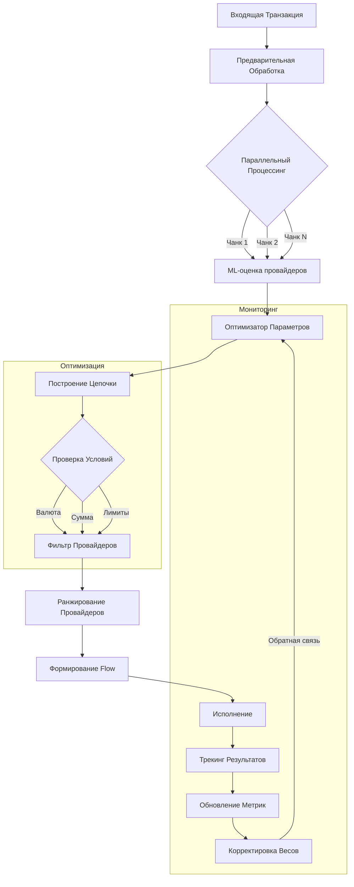
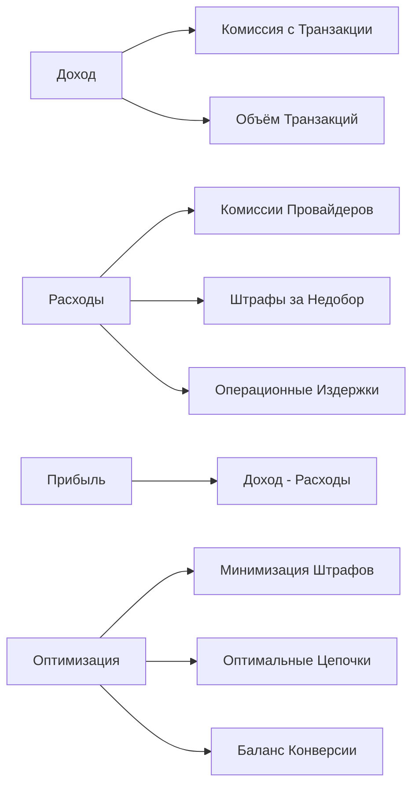

# Диаграмма Решения и Экономическое Обоснование

## 1. Архитектурная Диаграмма



## 2. Экономическое Обоснование

### 2.1 Факторы Максимизации Прибыли

1. **Оптимальная Длина Цепочки**
   ```python
   profit = transaction_amount * (1 - provider_commission) - chain_length * avg_processing_cost
   ```
   - Короткие цепочки → меньше накладных расходов
   - Длинные цепочки → выше вероятность успеха
   - Оптимум: баланс между стоимостью попыток и вероятностью успеха

2. **Приоритизация Транзакций**
   ```
   Приоритет = (Сумма * Маржинальность) / (Риск * Время обработки)
   ```
   - Крупные транзакции → больше попыток (выше потенциальная прибыль)
   - Малые транзакции → оптимизация на скорость (минимизация издержек)

3. **Балансировка Нагрузки**
   ```
   Эффективность = (Успешные транзакции * Средний доход) - (Штрафы за недобор + Издержки на обработку)
   ```
   - Распределение по провайдерам для минимизации штрафов
   - Учёт LIMIT_MIN для предотвращения штрафов
   - Оптимизация использования провайдеров с низкой комиссией

### 2.2 Экономическая Модель



### 2.3 Ключевые Метрики ROI

1. **На уровне транзакции:**
   ```
   ROI_transaction = (profit_from_success * success_probability) - 
                    (processing_cost * chain_length)
   ```

2. **На уровне провайдера:**
   ```
   ROI_provider = (total_profit - commission_costs) /
                 (fixed_costs + penalty_risks)
   ```

3. **На уровне системы:**
   ```
   System_efficiency = (total_profit) /
                      (total_processing_costs + total_penalties)
   ```

## 3. Обоснование Архитектурных Решений

1. **Параллельная Обработка**
   - Снижение latency → меньше отказов клиентов
   - Увеличение пропускной способности → больше транзакций
   - ROI: Повышение утилизации системы при тех же ресурсах

2. **ML-компонент**
   - Предсказание успешности → меньше неудачных попыток
   - Оптимизация цепочек → снижение издержек
   - ROI: Повышение конверсии при снижении стоимости обработки

3. **Динамическая Оптимизация**
   - Адаптация к изменениям → стабильная прибыль
   - Балансировка нагрузки → оптимальное использование ресурсов
   - ROI: Максимизация прибыли в долгосрочной перспективе

## 4. Экономический Эффект

1. **Краткосрочный:**
   - Снижение операционных издержек
   - Повышение конверсии
   - Минимизация штрафов

2. **Долгосрочный:**
   - Масштабируемость системы
   - Предсказуемость результатов
   - Оптимизация ресурсов

3. **Конкурентные преимущества:**
   - Высокая скорость обработки
   - Надёжность системы
   - Адаптивность к изменениям рынка 